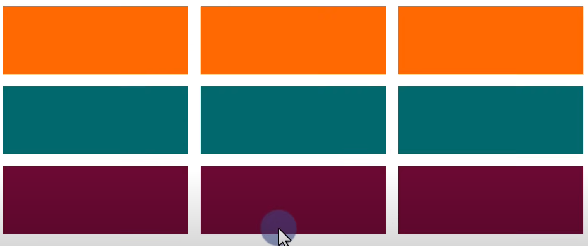
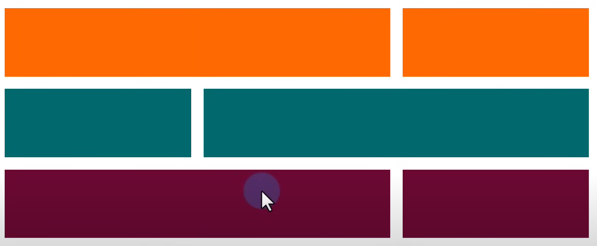
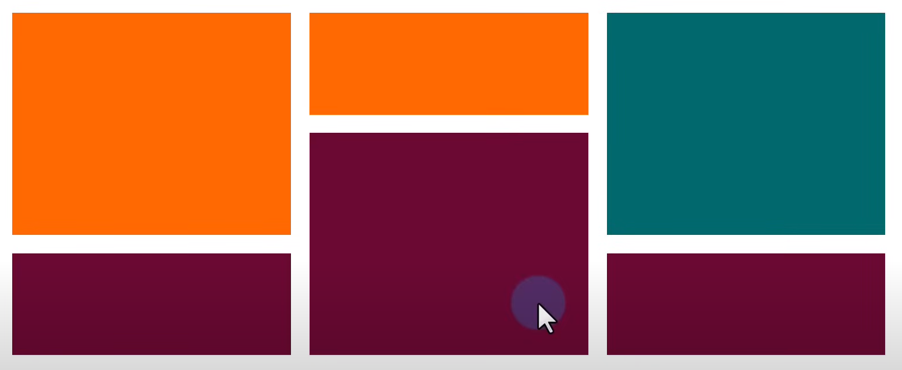
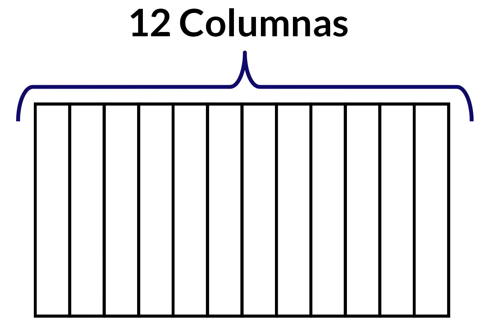
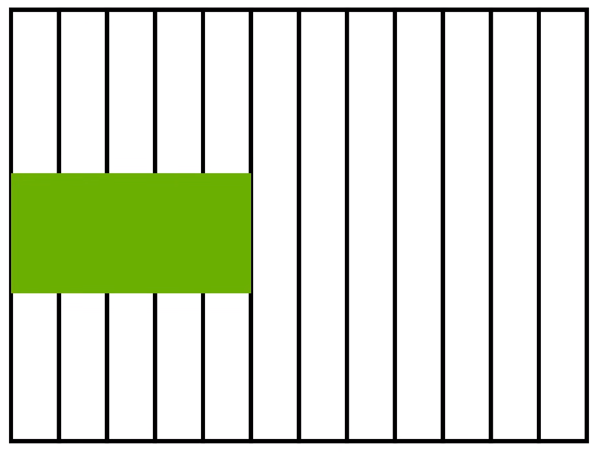
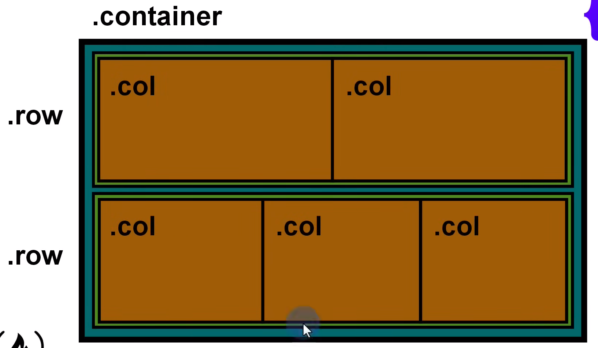

# bootstrap
In this repository, I will take notes on the documentation for Bootstrap 5 and code some basic examples.

Bootstrap es un framework CSS utilizado para desarrollar sitios web responsive.

Un framework CSS es un conjunto de clases que nos permite personalizar el estilo de los elementos HTML de nuestro sitio web.

# Los pilares de bootstrap
Tres de los elementos principales que se van a abordar son:
- Grid: Nos va a permitir definir como se van a estructurar los elementos de la pagina web y como se van a adaptar dependiendo del dispositivo.

- Componentes: Son elementos HTML reutilizables que ya con estilos predeterminados como lo pueden ser el carousell.

- Iconos: Bootstrap incluye muchos iconos que se usan para la apariencia de la pagina web.

## Grid
La grid o cuadricula se puede definir como un conjunto de contenedores, filas y columnas que definen como se va a presentar y a alinear el contenido.

Supongamos que queremos agregar una galeria de fotos en nuestra pagina web, la grid no va a permitir alinearlo de la siguiente manera:


Pero tambien nos permitira hacerlo de la siguiente manera:


Y tambien asi:


En pocas palabras, la grid nos permite organizar los elementos que tenemos en la pantalla.

Dentro de bootstrap hay un concepto muy importante el cual es que nos permite trabajar con filas y columnas, pero cada fila va estar dividida en 12 columnas.


Si quisieramos que nuestro elemento usara 5 columnas de 12 es posible configurarlo en las clases de bootstrap y se veria algo asi:


### Clases para la grid.
Existen diferentes clases para cada tipo de elemento, algunas de las clases de la grid son las siguientes:

#### .row
La clase row indica que ese elemento html se va a convertir en una fila para bootstrap.
Supongamos que tenemos un div de la siguiente manera:
```html
<div class="row">

</div>
```

Si hacemos lo anterior, el div va a poder actuar como una fila y esta va a adquirir propiedades css que vienen preestablecidad para filas en bootstrap.

#### .col

La clase de las columnas nos ofrece diferentes breakpoints, los cuales son un indicador de que tan grande puede ser el viewport antes de que se cambien de tamaño los elementos.

La siguiente tabla contiene los breakpoints que estan previamente establecidos.

|                           | xs <br> <576px | sm <br> ≥576px | md <br> ≥768px | lg <br> ≥992px | xl <br> ≥1200px | xxl <br> ≥1400px |
|---------------------------|----------------|----------------|----------------|----------------|-----------------|-----------------|
| **Contenedor (max width)**| None (auto)    | 540px          | 720px          | 960px          | 1140px          | 1320px          |
| **Class prefix**          | `.col-`        | `.col-sm-`     | `.col-md-`     | `.col-lg-`     | `.col-xl-`      | `.col-xxl-`     |
| **# of columns**          | 12             | 12             | 12             | 12             | 12              | 12              |

A continuacion se muestra un ejemplo de un contenedor con 2 filas, la primera fila contiene 2 columnas alineadas de manera automatica y la segunda fila contiene 3 filas alineadas de manera automatica.

```html
<div class="container">
    <div class="row">
        <div class="col"></div>
        <div class="col"></div>
    </div>
    <div class="row">
        <div class="col"></div>
        <div class="col"></div>
    </div>
</div>
```

La salida del HTML anterior seria algo como la siguiente:



## Componentes
## Iconos

